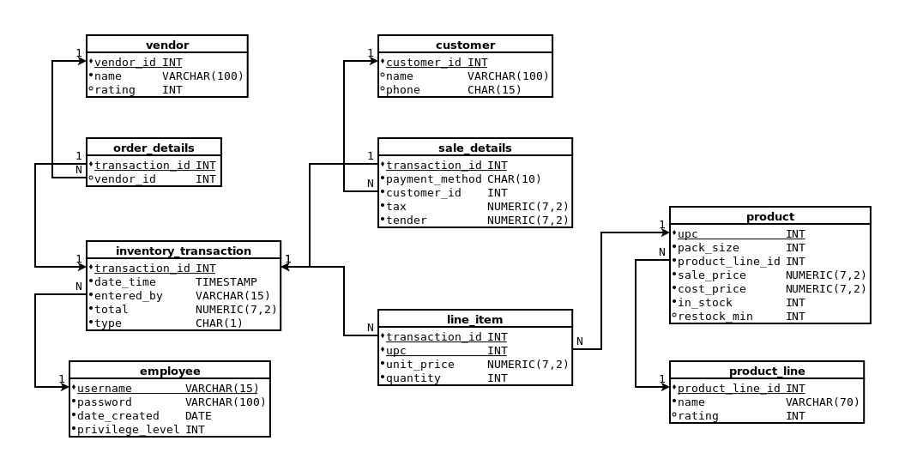

lightcoin
=========

**lightcoin** is a web-based point-of-sale software for small,
single-location retail stores. It can be used to:
* manage a store's inventory
* run the checkout lane
* record incoming shipments or loss of products
* keep track of customers and vendors
* report some basic sales statistics, such as top-selling items

lightcoin is currently incomplete -- see "Known Issues and Future Steps"
below.

Quickstart
==========

lightcoin is not currently packaged for distribution. Contact the repository
owner for access to a test server.

Interface
---------

lightcoin's main function is to keep track of the store's inventory. To get
started, head to the **Products** link in the navigation bar and add some
products. Adding a product here does not mean that you have that product in
the store -- the default quantity will be zero.
Products need to be added to the inventory before
anything can be done with them (selling, recording shipments, etc.).

Once you have entered some products, you can edit the inventory through
three types of transactions (links on the left-hand side of the navigation
bar):
* **Make Sale** -- This is the "checkout lane" interface. Items added
  to a sale record will have their quantity reduced in the inventory.
* **Add Inventory** -- Use this to record the arrival of an order.
  Items added to an order record will have their quantity increased in
  the inventory.
* **Report Breakage** -- Use this to record loss of product. Items
  added to a breakage report will have their quantity reduced in
  the inventory.

The additional links on the right-hand side of the navigation bar can be
used to manage **Customers**, **Vendors**, and **Employees**.
The **Transactions** interface allows viewing old transactions and resuming
incomplete ones.

Technical Overview
==================

lightcoin is written with Flask, a web framework for Python. The visual
interface is written in HTML with Jinja2 templating and CSS styling.
The store's information is stored in a MySQL database.

Navigating the Source Code
--------------------------

The web app's logic is in `FlaskApp/main.py`. HTML/Jinja2 templates are in
`FlaskApp/templates/` and CSS stylesheets are in `FlaskApp/static/`.

The database structure and its stored procedures are saved as a MySQL
dump in `MySQLDump/`.

Data Model
----------

Below is an entity-relationship diagram for the database. Each box represents
a table, and arrows between attributes represent foreign key references.

Known Issues and Future Steps
=============================

lightcoin is incomplete software and currently should not be used in a
production environment.

Security
--------

* **SQL injection** -- Input is not currently sanitized beyond type-checking
  arguments to stored procedures. Future: sanitize input on entry.
* **User privilege** -- While the interface and database require each employee
  to have an integer "privilege level," this privilege level is not currently
  used. Future: hide certain interfaces (employee/customer management, orders)
  from low-privilege employees.

Interface
---------

* **Type checking and error handling** -- There are several ways for the user
  to enter bad input (nonexistent UPC, entering a letter as
  a quantity, etc.) that will currently lead to a server error, forcing the
  user to use their browser's back button to return to the interface.
  Future: check for these errors and handle them accordingly, returning the user
  to the interface and highlighting the field that caused the error.
* **Store information** -- Currently the only store information stored is
  the tax rate. Future: store the store's name, address, phone number, etc.
* **Tax rate** -- There is no interface to edit the tax rate, although it can
  be changed in the database. Future: allow changing the tax rate from
  lightcoin.
